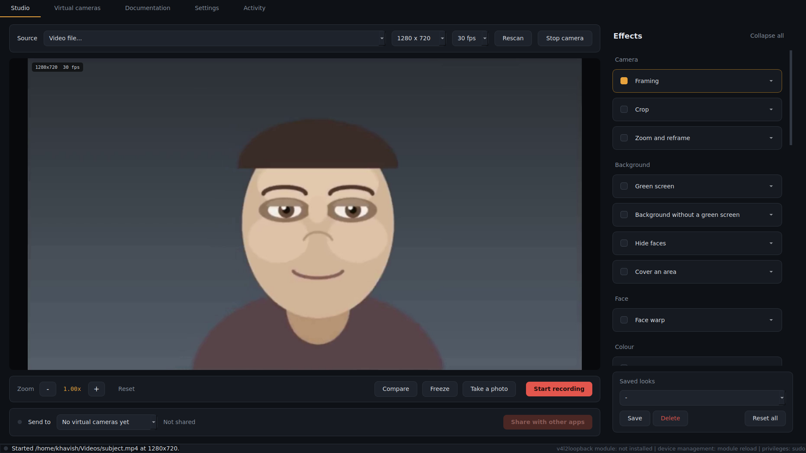
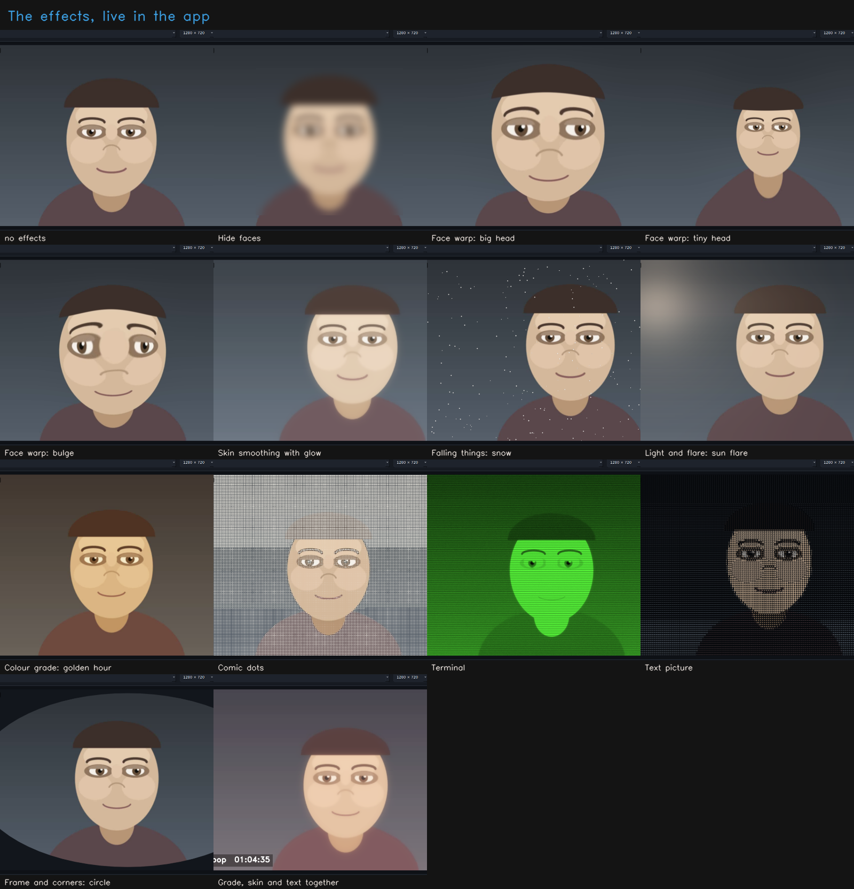
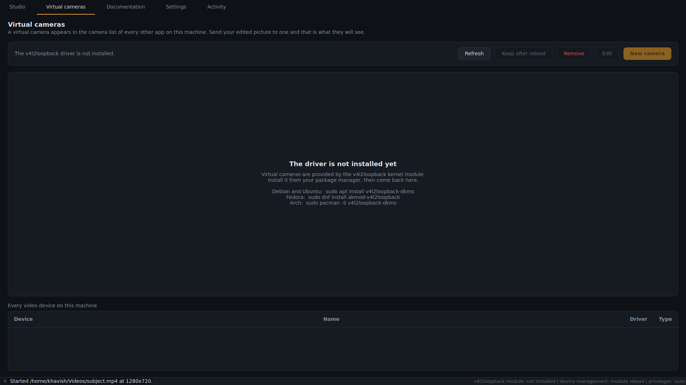
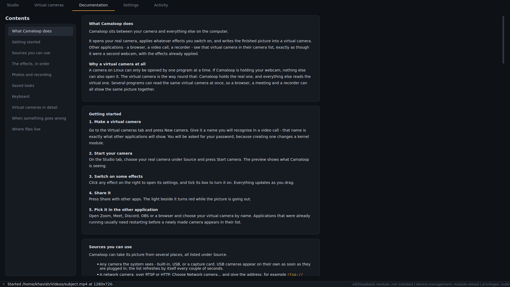
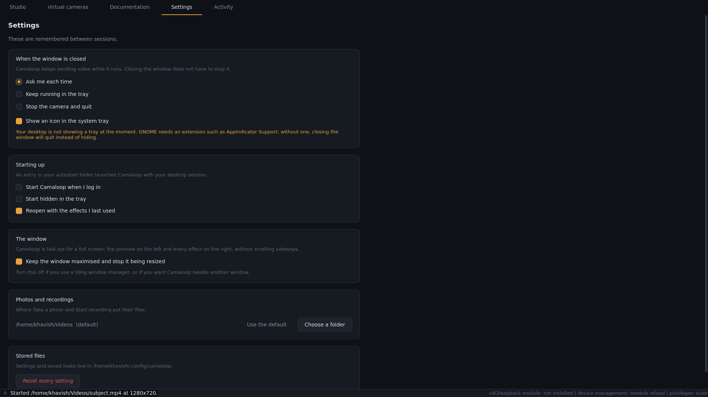
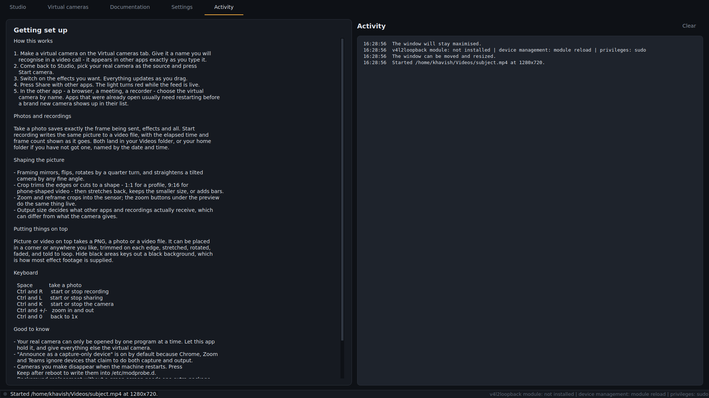

<h1 align="center">Camaloop</h1>

<p align="center">
  <strong>One camera in, any camera out.</strong><br>
  Your webcam, edited as it runs, published as a second camera that browsers,
  video calls and recorders can select like any other.
</p>

<p align="center">
  
  
  
  
  
  <a href="https://github.com/a-khavish/camaloop/actions/workflows/ci.yml"></a>
</p>

<p align="center">
  
</p>

---

## Read this before you install

**Linux only, and only really tested on Ubuntu.** Camaloop talks to
Video4Linux directly - it opens `/dev/video*` and drives the kernel's own
ioctls - so it cannot run on Windows or macOS at all, and there is no plan for
it to. It is developed and tested on Ubuntu. Other distributions are covered by
the installer and ought to work, but nobody has proven it on them.

**This is a new project at its first release.** Version 1.0.0 is the first one
there has ever been. The test suite is thorough and the code is careful, but it
has not had the years of other people's hardware that shake the last problems
out of something like this. Expect to meet a rough edge.

**It needs OpenCV 4, not OpenCV 5.** Version 5 removed the face detector
Hide faces and Face warp are built on. Camaloop asks pip for
`opencv-python>=4.5,<5` so a fresh install gets a working one, and if you end
up on version 5 anyway the face effects grey themselves out and say why rather
than quietly finding nobody.

**Virtual cameras need the `v4l2loopback` kernel module.** Without it Camaloop
still runs - you can preview every effect, take photos and record video - but
nothing else on the machine can see the result, because there is no device for
it to appear on. The installer offers to set the module up for you.

**Wayland screen capture needs the desktop portal.** Using your screen or a
window as a camera goes through `xdg-desktop-portal` plus the portal backend
for whichever desktop you run - GNOME, KDE or wlroots. On X11 it uses ffmpeg
instead and needs none of that.

I would rather you skipped Camaloop than installed it expecting something it
is not.

---

## Why

Every application that uses your camera has its own idea of what you can do
with it. One lets you blur the background, another crops differently, a third
gives you nothing at all. None of them lets you use two at once, and none of
them can be used by a program that has no camera settings of its own.

The camera is not the place to fix this. The place to fix it is between the
camera and everything else.

Camaloop opens your real camera once, applies whatever you have switched on,
and writes the finished picture into a **virtual camera** - an ordinary V4L2
device that every application on the machine can already open. Your browser,
your video call, your recorder and your streaming software all see a second
webcam in their camera list, with the effects already in it. Nothing has to be
taught about Camaloop, and nothing has to support it.

The same door works the other way. Because the input is just a source and the
output is just a device, the thing feeding that virtual camera does not have to
be a camera at all: a network camera, a video file on a loop, a still image, a
test pattern, or your screen.

```bash
bash setup.sh
```

One command installs the libraries and the driver, puts you in the `video`
group, makes your first virtual camera, tests the whole path and offers to
start the app. It covers apt, dnf, pacman, zypper, apk, xbps and eopkg.

**[Installing](#installing)** - **[The effects](#the-effects)** -
**[Wayland](#wayland)** - **[Troubleshooting](#when-something-goes-wrong)** -
**[Contributing](CONTRIBUTING.md)**

---

## Seeing it work

Thirty-two effects. Face warps, skin smoothing, falling snow, light leaks and
the rest, all running live:



`docs/demo.mp4` is a screen recording of the app being driven through them.

---

## What it does

**Edit the camera as it runs.** Thirty-two effects, each with its own
controls, all updating as you drag. Mirror, flip, rotate and straighten; crop
to any shape; zoom into the sensor; fix exposure and colour; smooth skin;
replace the background with or without a green screen; blur out faces that
wander into shot; add light leaks, motion trails, falling snow; rebuild the
picture out of typed characters; and lay text, a logo or a playing video over
the top.

**Use the screen as a camera.** A window, a screen or a rectangle of one
becomes a camera other applications can select - through the desktop portal on
Wayland, and ffmpeg's X11 grabber on X11.

**Take photos and record video.** A still or a video of the finished picture,
saved from inside the app, with every effect already applied.

**Manage virtual cameras.** Create them, rename them, set their frame rate and
fixed size, give them a standby image, remove them, and keep them across
reboots. Nothing has to be done in a terminal.

---

## What it looks like

<details open>
<summary><strong>Virtual cameras, without a terminal</strong></summary>
<br>

Make one, name it what you want other apps to show, give it a frame rate and
a standby picture, and keep it across reboots. Every video device on the
machine is listed underneath, real and virtual, with the driver behind it.


</details>

<details>
<summary><strong>The manual is in the app</strong></summary>
<br>

Every effect and every control is documented inside Camaloop, so there is
nothing to look up in a browser while you are in a call. A test keeps it
honest: no effect may exist without an entry here.


</details>

<details>
<summary><strong>Settings that say what they do</strong></summary>
<br>

Where photos and recordings go, what closing the window means, whether
Camaloop starts with your session, and whether it stays maximised. Each one
says plainly what it will do rather than naming a preference.


</details>

<details>
<summary><strong>Everything it did, in order</strong></summary>
<br>

The activity log records what Camaloop did and what it found - the driver, the
privileges it has, the source it opened. When something does not work, this is
the first place to look, and it is the thing worth pasting into an issue.


</details>

---

## Installing

**The short version.** From a clone of this repository:

```bash
bash setup.sh
```

That is the whole thing. It covers apt, dnf, pacman, zypper, apk, xbps and
eopkg - Debian, Ubuntu, Mint, Fedora, RHEL, Arch, Manjaro, openSUSE, Alpine,
Void and Solus, and anything derived from them. It asks before anything that
changes your system, and running it twice is safe: steps already done are
reported and skipped.

### Step by step, if you have not done this before

Nothing here assumes you know what a terminal is. Every line in a grey box is
something you type and then press Enter.

<details open>
<summary><strong>1. Open a terminal</strong></summary>
<br>

A terminal is a window you type commands into. Every Linux desktop has one.

- **Ubuntu, Mint, most desktops:** hold **Ctrl** and **Alt** and press **T**.
- **If that does nothing:** press the **Super** key (the one with the Windows
  logo), type `terminal`, and press Enter.

A window opens with a line of text ending in `$`. That is the prompt, and it
is waiting for you. You can make the text bigger with **Ctrl** and **+**.
</details>

<details open>
<summary><strong>2. Get the files</strong></summary>
<br>

There are two ways. The first is one line and keeps updating easy, so use it
unless it fails.

**With git** (type this, press Enter):

```bash
git clone https://github.com/a-khavish/camaloop.git
```

If that answers `git: command not found`, install git first and then run the
line above again:

```bash
sudo apt install git         # Ubuntu, Debian, Mint
sudo dnf install git         # Fedora
sudo pacman -S git           # Arch, Manjaro
```

It will ask for your password. **Nothing appears as you type it** - no dots,
no stars. That is normal. Type it and press Enter.

**Without git**, download the folder instead:

1. Go to [the project page](https://github.com/a-khavish/camaloop).
2. Click the green **Code** button near the top right.
3. Click **Download ZIP**. It lands in your Downloads folder.
4. Back in the terminal:

```bash
cd ~/Downloads
unzip camaloop-main.zip
```

GitHub names the folder after the branch, so you get `camaloop-main` rather
than `camaloop`. That is fine - just use that name in the next step.
</details>

<details open>
<summary><strong>3. Go into the folder</strong></summary>
<br>

`cd` means "change directory". It moves the terminal into a folder, the same
way double-clicking moves a file manager into one.

```bash
cd camaloop
```

If you downloaded the ZIP instead, the folder has a different name:

```bash
cd ~/Downloads/camaloop-main
```

To check you are in the right place, type `ls` and press Enter. You should
see `setup.sh`, `README.md` and a `camaloop` folder listed. If instead you see
`No such file or directory`, the folder name is different - type `ls ~` to see
what is in your home folder and use whichever name is there.
</details>

<details open>
<summary><strong>4. Run the installer</strong></summary>
<br>

```bash
bash setup.sh
```

It tells you what it is about to do and waits for you to agree. Press **y**
and Enter to accept a step, or **n** and Enter to skip it. It asks for your
password when it needs to install something, and again nothing appears as you
type.

It takes a few minutes, mostly downloading. At the end it prints a summary
and offers to start the app.
</details>

<details open>
<summary><strong>5. Two things to finish</strong></summary>
<br>

**Log out and back in.** The installer adds you to the group that is allowed
to open cameras, and Linux only applies group changes when you log in. Until
you do, the camera list in the app will be empty. Logging out and back in is
enough - you do not need to restart the machine.

**Then start it.** Camaloop is now in your applications menu like anything
else: press **Super**, type `camaloop`, press Enter. Or from a terminal,
anywhere:

```bash
camaloop
```
</details>

<details>
<summary><strong>If something went wrong</strong></summary>
<br>

Run this and read what it says - it checks everything and tells you what to do
about anything missing:

```bash
camaloop --check
```

There is a table of the common failures further down, under
[When installing goes wrong](#when-installing-goes-wrong). If none of it
helps, [open an issue](https://github.com/a-khavish/camaloop/issues) and paste
what `camaloop --check` printed.
</details>

### What `setup.sh` actually does

Worth knowing before you let a script use `sudo`. In order, it:

1. Works out your distribution and package manager, and checks your Python is
   3.8 or newer.
2. Installs the libraries - PyQt5, OpenCV, NumPy, Pillow - from your
   distribution's own packages. Every package name is checked against the
   archive first, so one name a release has dropped or renamed can never stop
   the rest from installing.
3. Installs the `v4l2loopback` kernel module and, where it exists, `polkit`,
   so the app can ask for a password in a window rather than a terminal.
4. Installs the desktop extras: `ffmpeg`, `xdg-desktop-portal`, the Wayland
   Qt platform plugin, and the PipeWire GStreamer bridge.
5. Installs Camaloop itself into `/usr/local` (or `~/.local` with `--user`),
   with a menu entry and an icon.
6. Adds you to the `video` group, which is what lets you open `/dev/video*`.
7. Loads the kernel module and makes a first virtual camera called Camaloop.
8. Runs every effect once, then pushes frames through the virtual camera and
   reads them back, to prove the whole path works.
9. Prints a summary, and offers to start the app.

### The flags

| Flag | What it does |
|---|---|
| `bash setup.sh` | the lot, asking before each change |
| `--yes` (`-y`) | never ask; answer yes to everything |
| `--user` | install into `~/.local`, no root for the app itself |
| `--venv` | keep the libraries in a private environment of the app's own |
| `--venv=PATH` | use an environment that already exists |
| `--no-venv` | never fall back to one; fail instead |
| `--extras` | also install `mediapipe`, for background replacement with no green screen |
| `--skip-tests` | install only, run nothing |
| `--no-launch` | do not offer to start the app at the end |

### Four ways in

| Route | Best when |
|---|---|
| `setup.sh` | you want it to work and do not want to think about it |
| the `.deb` from [Releases](https://github.com/a-khavish/camaloop/releases) | Debian, Ubuntu or Mint, and you would rather your package manager owned it |
| `install.sh` | you want the app installed but your libraries managed yourself |
| `python3 run.py` | you just want to look at it, and install nothing |

<details>
<summary><strong>From a clone</strong></summary>
<br>

```bash
git clone https://github.com/a-khavish/camaloop.git
cd camaloop
bash setup.sh
```

If you already have PyQt5, OpenCV 4 and NumPy, skip installing altogether:

```bash
python3 run.py
```
</details>

<details>
<summary><strong>From the release package, on Debian, Ubuntu or Mint</strong></summary>
<br>

Take `camaloop_1.0.0_all.deb` from the
[latest release](https://github.com/a-khavish/camaloop/releases/latest):

```bash
sudo apt install ./camaloop_1.0.0_all.deb
sudo apt install v4l2loopback-dkms v4l2loopback-utils
sudo usermod -aG video $USER      # then log out and back in
```

The package depends on your distribution's `python3-pyqt5`, `python3-opencv`
and `python3-numpy`, so apt pulls those in itself. It deliberately does not
depend on `v4l2loopback` - the app is still useful without it, and a kernel
module is not something a package should drag in behind your back.

Building it yourself instead of downloading it:

```bash
bash packaging/build-deb.sh
```
</details>

<details>
<summary><strong>Your distribution's packages, by hand</strong></summary>
<br>

These are exactly what `setup.sh` installs, if you would rather run the
commands yourself. The first line is the app's libraries, the second the
virtual camera driver, the third the desktop extras.

**Debian, Ubuntu, Mint**

```bash
sudo apt install python3 python3-pip python3-pyqt5 python3-opencv opencv-data python3-numpy python3-pil
sudo apt install v4l2loopback-dkms v4l2loopback-utils
sudo apt install qtwayland5 python3-gi gstreamer1.0-pipewire xdg-desktop-portal ffmpeg
```

**Fedora, RHEL**

```bash
sudo dnf install python3 python3-pip python3-qt5 python3-opencv opencv-data python3-numpy python3-pillow
sudo dnf install akmod-v4l2loopback v4l2loopback-utils
sudo dnf install qt5-qtwayland python3-gobject pipewire-gstreamer xdg-desktop-portal ffmpeg-free
```

**Arch, Manjaro**

```bash
sudo pacman -S python python-pip python-pyqt5 python-opencv opencv-samples python-numpy python-pillow
sudo pacman -S v4l2loopback-dkms v4l2loopback-utils
sudo pacman -S qt5-wayland python-gobject gst-plugin-pipewire xdg-desktop-portal ffmpeg
```

**openSUSE**

```bash
sudo zypper install python3 python3-pip python3-qt5 python3-opencv opencv-devel python3-numpy python3-Pillow
sudo zypper install v4l2loopback-kmp-default v4l2loopback-utils
sudo zypper install libqt5-qtwayland python3-gobject gstreamer-plugin-pipewire xdg-desktop-portal ffmpeg
```

**Alpine**

```bash
sudo apk add python3 py3-pip py3-qt5 py3-opencv py3-numpy py3-pillow
sudo apk add v4l2loopback-src v4l2loopback-lts v4l-utils
sudo apk add qt5-qtwayland py3-gobject3 gst-plugins-good xdg-desktop-portal ffmpeg
```

**Void**

```bash
sudo xbps-install python3 python3-pip python3-PyQt5 python3-opencv python3-numpy python3-Pillow
sudo xbps-install v4l2loopback v4l-utils
sudo xbps-install qt5-wayland python3-gobject gst-plugins-good1 xdg-desktop-portal ffmpeg
```

**Solus**

```bash
sudo eopkg install python3 python3-pip pyqt5 python3-opencv python3-numpy python3-pillow
sudo eopkg install v4l2loopback
sudo eopkg install qt5-wayland python3-gobject xdg-desktop-portal ffmpeg
```

Then install the app itself:

```bash
./install.sh              # for everyone, into /usr/local
./install.sh --user       # just for you, into ~/.local
```

Debian and Ubuntu split OpenCV's detection data into a separate `opencv-data`
package that nothing depends on. Leave it out and OpenCV still works
perfectly, but Hide faces and Face warp have nothing to find a face with.
Camaloop carries its own copy for exactly this reason, so it is not fatal -
but the system copy is the one to have.
</details>

<details>
<summary><strong>With pip, into an environment of your own</strong></summary>
<br>

```bash
python3 -m venv ~/.venvs/camaloop
~/.venvs/camaloop/bin/pip install -r requirements.txt
~/.venvs/camaloop/bin/python run.py
```

`requirements.txt` pins `opencv-python>=4.5,<5` on purpose. A plain
`pip install opencv-python` now gets version 5, which removed the face
finder - see [Requirements](#requirements).

pip's PyQt5 brings its own copy of Qt, tens of megabytes of it, and it will
not match the Qt your desktop is using. Your distribution's `python3-pyqt5`
is the better answer wherever it is available.
</details>

### The virtual camera driver

Everything except the virtual camera works without it. Without the module
there is simply no device for other applications to open, so the picture has
nowhere to go.

```bash
sudo modprobe v4l2loopback devices=1 video_nr=10 \
     card_label=Camaloop exclusive_caps=1
```

| Option | Why |
|---|---|
| `devices=1` | how many virtual cameras to create |
| `video_nr=10` | which `/dev/videoN` to use; pick a number no real camera has |
| `card_label=Camaloop` | the name other applications show in their camera list |
| `exclusive_caps=1` | announce it as capture-only. Chrome, Zoom and Teams ignore a device that claims to both capture and output, so without this it will not appear in them |

That lasts until you reboot. To make it permanent, Camaloop writes
`/etc/modprobe.d/camaloop.conf` and `/etc/modules-load.d/camaloop.conf` for
you when you tick **Keep after reboot** on the Virtual cameras tab - there is
no need to edit either by hand.

### Letting yourself open the camera

`/dev/video*` belongs to the `video` group. Without membership the camera list
comes up empty and nothing explains why:

```bash
sudo usermod -aG video $USER
```

**Group changes only take effect at login.** Log out and back in - not just a
new terminal. `id -nG` should then list `video`.

### On Wayland

The window itself works either way. Two things improve it:

```bash
sudo apt install qtwayland5          # draw natively instead of through XWayland
sudo apt install xdg-desktop-portal python3-gi gstreamer1.0-pipewire
```

The second line is what "screen as a camera" needs: the portal is how Wayland
asks your permission to share a screen, and it needs the backend for your
desktop - `xdg-desktop-portal-gnome`, `-kde` or `-wlr`. See
[Wayland](#wayland).

### Checking it worked

```bash
camaloop --check          # or: python3 run.py --check
```

That prints every library, every tool, the session type, whether face
detection has its data, and whether a virtual camera exists - each with what
to do about it when it is missing. It is also the right thing to paste into
an issue.

```bash
python3 tools/verify_pipeline.py
```

That one goes further: it writes frames into a virtual camera and reads them
back out, which is the only real proof the whole path works.

### Upgrading

```bash
cd camaloop
git pull
bash setup.sh
```

Your settings and saved looks live in `~/.config/camaloop` and are left
alone. From the `.deb`, `sudo apt install ./camaloop_1.0.0_all.deb` over the
top does the same.

### Uninstalling

```bash
./install.sh --uninstall      # however it was installed from a clone
sudo apt remove camaloop      # if it came from the .deb
```

Neither removes the `v4l2loopback` module, your virtual cameras, or your
settings. To go the whole way:

```bash
sudo apt remove v4l2loopback-dkms
sudo rm -f /etc/modprobe.d/camaloop.conf /etc/modules-load.d/camaloop.conf
rm -rf ~/.config/camaloop
```

### When installing goes wrong

| What you see | What it means |
|---|---|
| `externally-managed-environment` from pip | your distribution owns that Python (PEP 668). Use `bash setup.sh --venv`, or your package manager |
| The camera list is empty | you are not in the `video` group yet, or you have not logged out since being added |
| No virtual camera in the app | the module is not loaded. `lsmod \| grep v4l2loopback` should show it |
| The virtual camera exists but Chrome or Zoom cannot see it | it was created without `exclusive_caps=1`, or the application was already running when you made it. Restart the application |
| `modprobe: FATAL: Module v4l2loopback not found` | the DKMS build did not finish, usually because the kernel headers are missing: `sudo apt install linux-headers-$(uname -r)` |
| Qt exits with `could not load the Qt platform plugin "xcb"` | a missing X library, or a pip PyQt5 fighting the system Qt. Prefer your distribution's `python3-pyqt5` |
| Hide faces and Face warp are greyed out | either OpenCV's detection data is missing, or you are on OpenCV 5. The effect says which |

### Requirements

- Linux with Video4Linux, Python 3.8 or newer
- PyQt5, OpenCV 4 (`cv2`) and NumPy. **Not OpenCV 5** - version 5
  removed the face finder every face effect depends on, so the
  requirement is `opencv-python>=4.5,<5`. Every distribution's own
  `python3-opencv` package is still version 4; only a plain
  `pip install opencv-python` would now pull version 5
- The `v4l2loopback` kernel module, for virtual cameras
- Optional: `mediapipe`, for background replacement without a green screen and
  for precise face tracking. Face detection itself needs nothing extra -
  see below
- Optional: `Pillow`, for accented and non-Latin text in the overlay
- Optional, for using the screen as a camera: `ffmpeg`; on Wayland also
  `xdg-desktop-portal` with the portal for your desktop, `python3-gi`, and
  either ffmpeg 7.1 or newer or `gstreamer1.0-pipewire`
- Optional, on Wayland: `qtwayland5` (`qt5-wayland`), so the window itself is
  drawn natively rather than through XWayland

The app still runs without `v4l2loopback` - you can preview effects and save
stills - but it needs the module to share the feed with other applications.

---

## Face detection

Hide faces and Face warp need OpenCV's face and eye detectors: two XML
files. Where those live depends on how OpenCV was
installed, and on Debian and Ubuntu they may not be installed at all - the
Python bindings come from `python3-opencv` while the data is in a separate
`opencv-data` package that nothing depends on. OpenCV then works perfectly
and every effect that looks for a face finds nothing.

Camaloop looks in each place the files are actually kept:

```
$CAMALOOP_CASCADES            an override, if you set one
cv2.data.haarcascades         where the pip wheels put them
/usr/share/opencv4/haarcascades
/usr/share/opencv/haarcascades
/usr/local/share/opencv4/haarcascades
camaloop/data/                the copy shipped with the app
```

The last of those means it works with nothing installed. If all of them
somehow came up empty, those two effects grey themselves out and name the
command to run rather than quietly doing nothing. `camaloop --check` reports
which copy is in use.

---

## Wayland

Everything works on Wayland. Two parts of it are worth knowing about.

**The window.** Qt draws through XWayland unless `qtwayland5` (`qt5-wayland`
on Arch and Fedora) is installed, which the installer takes care of. With it,
the window is a native Wayland surface and scales properly on a HiDPI screen.
Either way the app runs.

**Screen capture.** Wayland deliberately stops any application from reading
the screen behind your back, so there is a portal to ask through instead.
Camaloop picks whichever of these is available, best first:

| Route | When it is used | What you get |
|---|---|---|
| Desktop portal over PipeWire | `xdg-desktop-portal` and `python3-gi` are installed | Your desktop's own picker; a screen or a single window; full frame rate |
| `grim` | wlroots compositors with no portal | Works, at a lower frame rate |
| XWayland | nothing else available | Only XWayland windows; native Wayland windows come out black |

It tells you which it is using before it starts, and the Activity tab records
it. On GNOME and KDE the portal is normally already there; on Sway, Hyprland
and river, install `xdg-desktop-portal-wlr` (or `-hyprland`).

**Non-systemd systems.** Virtual cameras kept across reboots are written to
`/etc/modprobe.d/` and to both `/etc/modules-load.d/` and `/etc/modules`, so
they come back under systemd, OpenRC, runit and sysvinit alike.

---

## Notes for Ubuntu

**Your v4l2loopback version decides how cameras are managed.** Ubuntu 22.04 and
24.04 both ship 0.12.7, which has no `/dev/v4l2loopback` control device, so
every create or delete reloads the driver and all virtual cameras must be idle
at that moment. Ubuntu 25.10 and later ship 0.15.x, where cameras are added and
removed one at a time while everything else keeps streaming. The app detects
which you have and says so on the Virtual cameras tab; nothing needs
configuring either way.

**Secure Boot.** `v4l2loopback-dkms` compiles a module on your machine, and
Secure Boot will not load an unsigned one. The installer normally prompts you
for a password and asks you to reboot into the blue MOK manager screen to
enrol the key - do that, or the module silently fails to load. To check:

```bash
mokutil --sb-state          # is Secure Boot on?
sudo modprobe v4l2loopback  # "Key was rejected by service" means it is unsigned
```

Recent Ubuntu releases also offer prebuilt signed modules
(`linux-modules-v4l2loopback-generic`), which sidestep DKMS and MOK entirely.

**Snap-packaged browsers.** Firefox and Chromium ship as snaps on Ubuntu, and a
snap only sees cameras if its camera interface is connected:

```bash
snap connect firefox:camera
```

A snap also enumerates devices when it starts, so make your virtual camera
first and then start the browser.

**pip and "externally managed environment".** Ubuntu 24.04 and newer stop pip
from writing into the system Python. Install the Python libraries from apt
(`python3-pyqt5 python3-opencv python3-numpy`), which is what the installer
does, or use a virtual environment. `pip --break-system-packages` works too but
is not the tidy option.

---

## Five minutes to being live

1. On **Virtual cameras**, press **New camera** and give it a name. That name
   is what other applications will show, so make it recognisable. You will be
   asked for your password - creating the device touches a kernel module.
2. On **Studio**, choose your real camera and press **Start camera**.
3. Switch on the effects you want.
4. Press **Share with other apps**. The light goes red while the feed is live.
5. In the other application, pick your virtual camera by name.

Applications that were already running usually need restarting before a
brand new camera turns up in their list.

---

## The effects

| Group | Effect | What it is for |
|---|---|---|
| Camera | Framing | Mirror, flip, quarter turns, and a fine angle for straightening a tilt |
| Camera | Crop | Trim each edge, or cut to 1:1, 4:3, 16:9, 9:16 or 21:9 |
| Camera | Zoom and reframe | Crop into the sensor and move the crop around |
| Background | Green screen | Key out a colour, replace with a colour, image or blur |
| Background | Background without a green screen | On-device segmentation, needs mediapipe |
| Background | Hide faces | Blur, pixelate or block faces - everyone, only you, or everyone but you |
| Background | Cover an area | Hide a fixed rectangle: a doorway, a whiteboard, a window |
| Face | Face warp | Big head, tiny head, wide, narrow, tall, bulge, pinch, wobble, swirl |
| Colour | Exposure | Brightness, contrast, shadow lift |
| Colour | Colour | Saturation, hue, warmth |
| Colour | Skin smoothing | Softens skin, keeps eyes, hair and edges sharp |
| Colour | Colour grade | Twelve finished looks in one step, from Golden hour to Bleach bypass |
| Colour | Look | Black and white, sepia, inverted, posterised, thermal, night vision, high contrast |
| Colour | Two-tone | Map the picture between any two colours |
| Texture | Softness and detail | Overall softening or sharpening |
| Texture | Glow | Light blooming out of the bright parts |
| Texture | Light and flare | Warm or cool leaks, a rainbow, a sun flare, a corner glow, haze |
| Texture | Motion trails | Light trails, echo, ghosting, or a frozen background |
| Texture | Depth blur | Keep one band sharp and blur away from it |
| Texture | Stylise | Cartoon, pencil sketch, edges, emboss, mosaic |
| Texture | Comic dots | A printed halftone in dots, lines or crosshatch |
| Texture | Glitch | Blocks slipping sideways, colour separation, bands tearing |
| Texture | Terminal | An old phosphor monitor in green, amber, cyan, white or red |
| Texture | Mirror and kaleidoscope | Fold the picture back on itself |
| Texture | Text picture | Rebuild the picture out of typed characters |
| Texture | Vignette | Darken the corners |
| Texture | Film and tube | Grain, scanlines, colour split |
| Overlay | Text | Any text, plus `{time}`, `{date}` and `{fps}` |
| Overlay | Picture or video on top | A PNG, photo or playing video, placed anywhere, trimmed, stretched, rotated and faded |
| Overlay | Falling things | Snow, rain, sparkles, confetti, bubbles, embers, leaves or stars |
| Output | Output size | What other apps and recordings actually receive |
| Output | Frame and corners | Rounded corners, a frame, a polaroid border, a circle, a soft edge |

### Photos and recordings

**Take a photo** saves exactly the frame being sent - every effect baked in,
at the output size, not a preview copy. **Start recording** writes the same
picture to a video file while showing the elapsed time and frame count, with a
REC marker on the preview. Both land in your Videos folder, named by date and
time. Recording keeps running while you change effects, so what you adjust
mid-take is what the file shows.

### Shaping the picture

Crop trims edges or cuts to a shape - 1:1 for a profile, 9:16 for phone-shaped
video - then stretches back to full size, keeps the smaller size, or adds bars.
Framing straightens a tilted camera by any fine angle, filling the corners by
zooming, leaving them empty, or stretching the edges. Output size decides what
other applications and recordings receive, which can differ from what the
camera gives: fit with bars, fill by cropping, or stretch.

### Putting things on top

**Picture or video on top** takes a PNG with transparency, a photo, or a video
file that plays and loops. Place it in a corner or anywhere with the Across and
Down sliders, trim any edge, stretch it, rotate it, fade it, and key out black
backgrounds for effect footage.

### Keyboard

| | |
|---|---|
| `Space` | take a photo |
| `Ctrl` `R` | start or stop recording |
| `Ctrl` `L` | start or stop sharing |
| `Ctrl` `K` | start or stop the camera |
| `Ctrl` `+` / `Ctrl` `-` | zoom in and out |
| `Ctrl` `0` | back to 1x |

Any combination can be saved as a named look and reloaded later. Looks live in
`~/.config/camaloop/presets/` as readable JSON.

---

## Speed

Measured at 1280x720 with OpenCV restricted to a single thread, so a real
desktop will be quicker:

| Effect | Cost per frame |
|---|---|
| Colour, Output size, Softness and detail, Picture or video on top | under 0.5 ms each |
| Look, Exposure, Vignette, Mirror and kaleidoscope, Film and tube, Text, Glitch | 0.6 - 1.5 ms |
| Motion trails, Framing, Crop, Falling things | 2 - 3.5 ms |
| Face warp, Colour grade, Zoom and reframe | 4 - 5 ms |
| Two-tone, Hide faces, Light and flare, Glow, Frame and corners, Comic dots | 5 - 9 ms |
| Text picture, Cover an area, Depth blur, Terminal | 10 - 16 ms |
| Stylise (cartoon), Skin smoothing | 20 - 24 ms |
| Green screen | 10 ms with a hard edge, 20 ms with a soft one |
| **A typical stack of five or six** | **6 ms** |

Nothing in the list exceeds the 26 ms a frame that 30 fps allows, and a test
enforces that, so an effect cannot quietly become too slow to use. The
expensive ones do their heavy work on a reduced copy and scale the result back
up, and anything that mixes two pictures together goes through OpenCV rather
than whole-frame NumPy arithmetic - at 1080p that alone is the difference
between a smooth preview and a stuttering one.

---

## Running the tests

```bash
python3 tools/selftest.py               # every effect over a synthetic frame
python3 -m unittest discover -s tests   # the unit tests, 219 of them
python3 tools/smoketest.py              # builds the interface, draws it, and
                                        # checks it fits 1280x720 upwards
python3 tools/verify_pipeline.py        # end to end, needs v4l2loopback
```

`verify_pipeline.py` is the only one that needs a real kernel module: it makes
a virtual camera, pushes frames through it, reads them back and compares them.
The rest run anywhere, including in CI, with no display and no camera.

The layout checks want somewhere to put a large window. Qt's offscreen
platform pretends the screen is 800x600, so with no display those checks skip
themselves. To run the whole matrix - 1280x720 up to 2560x1440 - give them a
virtual display:

```bash
QT_QPA_PLATFORM=xcb xvfb-run -a --server-args="-screen 0 2560x1440x24" \
    python3 -m unittest discover -s tests
```

They resize the window to each size, assert the resize actually took effect,
and then check that no control has ended up outside the window.

---

## When something goes wrong

Start here:

```bash
camaloop --check
```

It prints the session type, which libraries and tools are present, how the
screen can be captured on this machine, whether face tracking is ready, and
every virtual camera it can see.

**The camera will not open.** Only one program can hold a camera at a time, so
close anything else using it. If it is refused outright, add yourself to the
`video` group and log back in:

```bash
sudo usermod -aG video $USER
```

**A virtual camera you made is not in the app's list.** Fixed in 1.3.1. The
driver names itself "v4l2 loopback" through the ioctl and "v4l2loopback" in
sysfs; the app now recognises both. What
the device is now comes from sysfs, so a camera still appears when it cannot
be opened - which happens when your user is not in the `video` group, and when
a camera made with *capture-only* announcement is already being streamed to.
The app also rescans on its own every couple of seconds, so a camera created
in a terminal turns up without pressing anything. To see what it can find:

```bash
camaloop --list-devices
```

**The virtual camera does not appear in another app.** Restart that app. If it
is Chrome, Zoom or Teams, make sure the camera was created with *Announce as a
capture-only device* switched on - those three ignore devices that claim to do
both capture and output. On Ubuntu, a snap-packaged Firefox or Chromium also
needs `snap connect firefox:camera`.

**Creating a camera asks for a password and then nothing happens.** On Secure
Boot machines the DKMS module has to be signed and its key enrolled before the
kernel will load it. `sudo modprobe v4l2loopback` reporting "Key was rejected
by service" confirms it. Reinstall `v4l2loopback-dkms` and follow the MOK
enrolment prompt at the next reboot.

**Cameras vanish after a reboot.** They are held in memory by the kernel
module. Press **Keep after reboot** to write the list to
`/etc/modprobe.d/camaloop.conf`.

**Removing a camera fails.** Something still has it open. The list marks those
as *In use by another app*. On systems with v4l2loopback older than 0.13 every
change reloads the module, so all virtual cameras must be idle.

**An accented name shows without its accents.** The text overlay falls back to
OpenCV's built-in font, which is ASCII only. Install Pillow for proper
rendering of accented, Greek, Cyrillic and similar text:
`sudo apt install python3-pil`. Chinese, Japanese and Korean additionally need
a CJK font installed, such as `fonts-noto-cjk`.

**Background replacement does nothing.** It needs mediapipe. The simplest way
is to let the installer put it where the app will find it:

```bash
bash setup.sh --extras
```

On Ubuntu 24.04 and newer the system Python is "externally managed" (PEP 668)
and refuses pip, so `--extras` builds an environment for the app and installs
it there, leaving your system Python untouched. A plain `pip install mediapipe`
either fails with that error or lands somewhere the app never looks.

mediapipe does not bundle the segmentation model, so the app downloads it once
(about 250 kB). If a firewall blocks that, the effect's "Model file" option
takes a `.tflite` you downloaded yourself.

**V4L2 is spoken directly.** `core/v4l2.py` builds the `VIDIOC_QUERYCAP` and
`VIDIOC_S_FMT` ioctls with `fcntl` and `struct`, so there is no dependency on
`pyvirtualcam`, `python-v4l2` or the `v4l2-utils` binaries for capture and
output. `tools/selftest.py` asserts the computed ioctl numbers match the
kernel's published constants, which is what proves the structure layouts are
right on your architecture.

**Device management has two back-ends.** With v4l2loopback 0.13 or newer and
`v4l2loopback-ctl` installed, cameras are added and removed one at a time while
the module stays loaded and other streams keep running. Otherwise the module is
reloaded with a rebuilt device list, which is why the app refuses that path
when a camera is in use.

**Privileged work never blocks the window.** Anything needing root goes through
`pkexec` on a background thread. If neither `pkexec` nor `sudo` can be used,
the exact command is shown so it can be run manually.

**The capture thread owns the pipeline.** Settings are read by the capture
thread and written by the interface thread, so all access goes through one
lock. A failing effect is caught, reported in the activity log, and skipped -
it never takes the stream down.

---

## Contributing

`CONTRIBUTING.md` covers running from a clone, the layout of the code, and
what to keep in mind when adding an effect.

---

## Licence

**Camaloop is free software under the [GNU General Public License, version 3](LICENSE).**

You may use it, study it, change it and pass it on. If you distribute it, or
anything built from it, you have to do so under the same licence and make the
source available. It comes with no warranty of any kind.

Camaloop is built on PyQt5, which Riverbank Computing licenses under the GPL or
a commercial licence. Releasing a PyQt5 application under anything more
permissive would sit badly with that, so the whole of Camaloop is GPLv3. The
rest of the stack is compatible: OpenCV is Apache 2.0 and NumPy is BSD.

`camaloop/data/` holds two files copied unchanged from OpenCV -
`haarcascade_frontalface_default.xml` and `haarcascade_eye.xml`. Each carries
its own Intel License Agreement notice in its header, a BSD-style licence that
permits redistribution provided that notice travels with it, and it does.

[NOTICE](NOTICE) lists all of this, along with every dependency and its
licence.

Copyright (c) 2026 Khavish Auckaloo.
